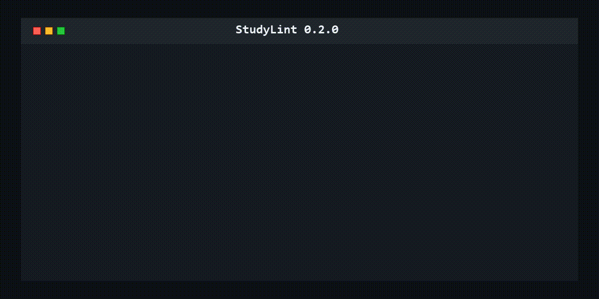

<p align="center">
  
</p>

<h1 align="center">StudyLint</h1>

<p align="center"><strong>打破学习中的AI幻觉：核查AI总结，也核查论文内容。</strong></p>

<p align="center"><a href="README.md">简体中文</a> · <a href="README_EN.md">English</a></p>

<p align="center">
  
  
  
</p>

<p align="center">
  <sub><a href="https://github.com/xunguangzlj-cloud/StudyLint">⭐ Star</a> · <a href="https://github.com/xunguangzlj-cloud">作者</a></sub>
</p>

StudyLint 是一个面向AI学习与AI辅助写作场景的证据核查工具。把AI总结和可信课程材料交给它，它会检查失效引用、页码与结论不匹配、直接引语错误和冲突定义；把AI生成的参考文献或写作稿交给它，它会核验论文记录，并逐处检查论述是否得到所引正文支持。

它不会把“相似文本”冒充已验证事实。基础规则核验不需要账号或大模型API；可选AI深度核验由使用者自行提供API Key。

<p align="center">
  
</p>

## 主要功能

- **AI总结核查**：支持Markdown、TXT、DOCX、PDF和EPUB总结，对照用户提供的可信资料检查引用位置、直接引语、数字和内部一致性。
- **灵活添加课程材料**：可以直接选择一个或多个资料文件，也可以选择文件夹递归读取。
- **检查页码和时间点**：发现不存在的PDF页码、PPT页码或字幕时间点。
- **核对页码是否支持结论**：不是只判断页码存在，还检查笔记内容与指定位置是否有明显文本关联。
- **核对直接引语**：检查引号内的原文能否在指定来源位置找到。
- **识别无法自动核验的页**：扫描图片页、空文本页和同名来源会单独提示，而不是误判内容错误。
- **推荐可能证据**：使用本地文本匹配提供最多3条候选来源，由用户最终确认。
- **发现冲突定义**：只对明确的定义表达或加粗术语标题比较定义，跳过表格字段和场景标签。
- **离线HTML报告**：显示问题原因、修改建议、笔记原文和可点击来源。
- **论文核查**：分为两个独立选项：“论文是否真实存在”核对DOI、题名、年份和撤稿标记；“论文内容幻觉核查”逐处连接论述、引用编号、参考文献和PDF/EPUB正文。
- **进度与精确定位**：三类核查均显示百分比和当前阶段；论文内容报告对Markdown/TXT显示行号、对DOCX显示段落号、对PDF显示页码及页内行号，并附上对应原句和引用编号。
- **原稿内联批注**：论文内容核查结果先显示完整原稿；有问题的句子使用红色下划线标出，旁边的小红色感叹号在悬停或键盘聚焦时显示问题类型与简短理由，完整证据收纳在下方折叠明细中。
- **报告不会丢失**：Windows版优先使用系统文件关联打开HTML；如果自动跳转失败，会显示报告路径，并可点击“打开核查报告”再次打开。
- **合法开放全文获取**：论文内容幻觉核查优先使用本地PDF/EPUB，也可根据高置信元数据从开放来源获取全文；若数据库未直接给出PDF，还会读取论文页面公开声明的标准PDF地址。获取失败会明确提示用户导入PDF或EPUB，不会据此声称论文不存在。
- **可选AI深度核验**：使用者自行填写OpenAI兼容接口、模型和API Key；可选择快速/严格模式及通用、医学、社会科学核验技能。AI结果按11类问题归类，规则结果与AI结果分开展示。
- **图形界面与CLI**：普通学生使用文件选择界面，开发者可使用终端和JSON。

## 最快使用方法：图形界面

Windows用户可从[GitHub Releases](https://github.com/xunguangzlj-cloud/StudyLint/releases/latest)下载安装版或portable免安装ZIP。推荐使用文件名含`setup`的安装版，它会创建桌面和开始菜单快捷方式；portable ZIP解压后即可运行，不会自动创建快捷方式。每个Release同时提供`SHA256SUMS.txt`供完整性校验。

从源码运行需要Python 3.10或更新版本：

```powershell
git clone <你的StudyLint仓库地址>
cd StudyLint
py -3.12 -m venv .venv
.\.venv\Scripts\Activate.ps1
pip install -e .
studylint gui
```

然后：

1. 在“AI总结核查”中选择一份Markdown、TXT、DOCX、PDF或EPUB总结；
2. 直接选择一个或多个PDF、EPUB、PPT、Word等可信资料文件，或选择整个资料文件夹；
3. 点击“开始核查”；
4. 在浏览器中分别查看确定错误、事实支持不足、内部冲突和证据候选。

核实AI生成的论文时，先切换到“论文核查”，再选择“论文是否真实存在”。每行粘贴一个DOI、论文标题或完整参考文献，然后点击“开始真实性核验”。也可以导入TXT或CSV清单。输入区支持右键剪切、复制、粘贴和全选。已通过的论文不显示；报告只列出需要用户自行核查的项目，每篇的检索链接会在新标签页打开。

核查整篇AI写作或辅助写作稿时，选择“论文内容幻觉核查”。可以导入本地PDF/EPUB引用文献，也可以让工具根据参考文献题名、DOI和元数据尝试获取合法开放全文。正文引用支持半角/全角方括号、组合与连续编号、圆括号数字、Unicode或DOCX上标数字，以及中英文作者—年份格式；作者—年份引用只在作者和年份能唯一匹配参考文献表时自动关联，避免猜错。建议把本地文件命名为`1-论文名.pdf`或`1-论文名.epub`。无法安全取得开放全文时，报告会保留元数据核验结果并提示导入PDF或EPUB，不会根据题名或摘要猜测正文支持关系。两个论文选项的输入和结果完全分开。

默认规则核验在本机运行。如果需要理解复杂转述，可以勾选“启用可选AI深度核验”，在“AI设置”中选择DeepSeek、OpenAI、Gemini、通义千问（阿里云百炼）或自定义OpenAI兼容服务，并填写自己的API Key。密钥只保存在当前运行内存中；StudyLint只发送论述、参考文献条目和已经定位的候选原文片段，不上传整篇写作稿、PDF或EPUB。

笔记与课程材料只在本机处理。生成的报告保存在笔记旁边：

```text
原文件：信息管理复习笔记.docx
报告：  信息管理复习笔记-studylint-report.html
```

## 命令行使用方法

### 检查整个资料文件夹

```powershell
studylint check "复习笔记.docx" `
  --source-dir "课程材料" `
  --format html `
  --open
```

`--source-dir`会递归发现文件夹内所有支持的课程材料，并自动排除正在检查的笔记。

### 明确指定来源文件

```powershell
studylint check notes.md `
  --source slides.pdf `
  --source lecture.srt
```

`--source`和`--source-dir`可以同时使用。

### 生成JSON结果

```powershell
studylint check notes.md `
  --source-dir materials `
  --format json `
  --output report.json
```

### 核实论文是否有登记记录

优先使用DOI：

```powershell
studylint paper "10.1038/nature12373" --format html --open
```

没有DOI时，可以输入标题或整条参考文献：

```powershell
studylint paper "Nanometre-scale thermometry in a living cell" --format html --open
```

批量核验时准备一个每行一篇的`papers.txt`：

```powershell
studylint paper --file papers.txt --format html --open
```

结果会显示标题、作者、年份、期刊、匹配度和论文链接。Crossref与OpenAlex先并行查询；只有当它们没有返回高匹配结果，或内容核查仍缺少开放全文时，才并行补查Semantic Scholar、arXiv、DBLP、Europe PMC与DOAJ，以兼顾速度和覆盖率。DBLP侧重计算机科学，Europe PMC侧重生命科学与生物医学，arXiv补充预印本，DOAJ补充开放获取期刊文章。低相关结果会被过滤，重复记录会合并来源，OpenAlex标记的撤稿论文会单独警告。

需要自行核查的项目会提供知网、Google Scholar和百度学术搜索链接。已通过的论文不会出现在报告中，待核查项也不展示数据库返回信息或技术错误，只引导用户打开检索入口确认。

### 论文内容幻觉核查

```powershell
studylint manuscript "AI辅助写作稿.docx" `
  --source-dir "引用文献原文" `
  --fetch-fulltext `
  --format html --open
```

也可以多次使用`--source`直接指定本地PDF或EPUB。StudyLint会提取每处已识别引用附近的完整论述，匹配参考文献表和本地原文；启用自动获取时，只会为高置信候选尝试下载合法开放全文。成功后给出正文支持等级、稿件中的精确位置与相关原文位置；失败时明确提示导入PDF或EPUB。半角/全角编号、圆括号数字、Unicode或DOCX上标、可唯一匹配的中英文作者—年份引用均可识别；脚注/尾注域、无法唯一匹配的同作者同年文献和扫描版PDF仍需人工核查。

### 可选AI深度核验

图形界面的“AI设置”采用BYOK（Bring Your Own Key）：提供DeepSeek、OpenAI、Gemini、通义千问（阿里云百炼）和自定义兼容接口预设。选择服务商后会自动填写推荐接口地址与模型，两项仍可修改。API Key会被遮盖且不会保存。命令行使用环境变量提供密钥，避免将密钥写入命令历史：

```powershell
studylint manuscript "AI辅助写作稿.docx" `
  --source-dir "引用文献原文" `
  --format html --open `
  --ai `
  --ai-endpoint "https://api.openai.com/v1/chat/completions" `
  --ai-model "你的模型名称" `
  --ai-mode strict `
  --ai-skill biomedical `
  --ai-key-env STUDYLINT_AI_API_KEY
```

可用模式：`fast`只复核规则无法直接确认的项目，节省时间和费用；`strict`复核所有具备正文证据的引用。可用技能：`general`、`biomedical`、`social_science`。AI问题类型固定为11类：引用/来源、事实背景、数据结果、方法过程、逻辑推理、数学公式、概念术语、归因来源、伦理合规、格式/内部一致性、时间/版本。接口需要兼容`chat/completions`消息格式；不同服务的费用、保存策略和数据处理规则由使用者自行确认。

退出码：

- `0`：笔记没有错误、全部论文都有可靠候选，或写作稿核验全部为直接支持；
- `1`：存在错误、不可靠候选，或任一写作稿核验结果需要复核；
- `2`：输入文件、参数或资料目录无效。

## 支持格式

| 用途 | 格式 | 说明 |
|---|---|---|
| AI总结核查 | Markdown、TXT、DOCX、PDF、EPUB | DOCX、PDF和EPUB中的位置按可提取结构显示 |
| 可信课程来源 | PDF、EPUB、PPTX、SRT、Markdown、TXT、DOCX | DOCX来源暂作为一个整体位置处理 |
| 论文内容幻觉核查 | Markdown、TXT、DOCX、PDF稿件 + 本地PDF/EPUB引用文献 | 支持多种数字及作者—年份引用；也可尝试获取合法开放全文 |

扫描版PDF如果没有文本层，目前不会自动OCR。StudyLint会读取可提取的文字，OCR将作为可选组件另行提供。

## 可靠能力边界

- 开放数据库未匹配或开放全文获取失败，都不能证明论文不存在；报告会提示继续人工检索或导入本地PDF/EPUB。
- StudyLint可以发现正文证据不足、数字冲突、否定方向相反、措辞夸大和部分内部不一致，但不能仅凭论文自述自动断言实验未实施、原始数据造假或伦理违规。
- 数学与公式分类用于提示可疑单位、数字、符号或证据不足，不代表工具已经完成完整数学证明、定理条件审查或统计方法验证。
- AI分类是基于候选证据的辅助判断；缺少可验证证据时应返回“证据不足”，关键结论仍需打开原文、原始数据、注册信息或权威版本人工确认。

## 可选引用语法

StudyLint不会因为一条结论没有来源标注就报警。如果希望核对某条结论与课程材料是否匹配，可以使用：

```markdown
信息具有可传递性。[slides.pdf#page=12]
老师强调需要理解该概念。[lecture.srt#time=00:31:42]
```

页码还可以写成`#p=12`、`#页=12`或`#页码=12`；时间点还可以写成`#t=00:31:42`或`#时间=00:31:42`。StudyLint会先确认位置存在，再检查结论与该位置文本是否匹配。

Markdown或TXT来源可以用标记模拟页码：

```markdown
<!-- page: 1 -->
第一页内容

<!-- page: 2 -->
第二页内容
```

## 忽略一次误报

在Markdown或TXT笔记中，把忽略指令放在需要忽略的内容前：

```markdown
<!-- studylint-ignore ST006 -->
这是我的概括。[slides.pdf#page=12]
```

该指令只影响下一条有效笔记，不会关闭后续检查。可以同时忽略多条规则：

```markdown
<!-- studylint-ignore ST005, ST006 -->
```

## 检查规则

| 规则 | 级别 | 含义 |
|---|---|---|
| `ST001` | 错误 | 引用的来源文件没有提供 |
| `ST002` | 错误 | 引用页码或时间点无效 |
| `ST003` | 错误 | 引号内的原文没有出现在引用位置 |
| `ST005` | 警告 | 明确定义的同一术语出现差异较大的解释 |
| `ST006` | 警告 | 笔记结论与所标页码或时间点缺少明显关联 |
| `ST008` | 警告 | 引用位置没有可提取文字，无法自动核验 |
| `ST009` | 错误 | 资料目录存在同名文件，引用来源不明确 |
| `ST010` | 警告 | 笔记中的数字没有出现在总体相关的引用位置 |

`ST003`检查直接引语，`ST006`检查结论与指定位置的文本支持度，`ST010`在页面总体相关时进一步核对数字。没有来源标注本身不会触发问题。StudyLint不会凭空判断世界知识真假：只有与用户提供的可信材料对照后，才能指出确定错误或证据不足。证据推荐只代表文本相关，不代表来源已经支持该结论。

## 速度优化

- 多份PDF、PPTX、DOCX和字幕材料会并行解析；
- 批量论文最多四路并行查询，同时保留输入顺序；
- 重复的文本标准化和相似度基础数据会缓存；
- 网络核验在后台执行，图形界面不会因批量任务失去响应。

## Windows安装版与免安装版

标签构建工作流会发布三个主要文件：每用户安装版`windows-x64-setup.exe`、免安装版`windows-x64-portable.zip`和`SHA256SUMS.txt`。GitHub还会自动提供源码ZIP/TAR。安装版会创建桌面与开始菜单快捷方式；portable版解压后直接运行，不会改动系统安装目录。

在Windows本机可以这样构建portable可执行文件：

```powershell
pip install -e ".[dev,build]"
pytest -q
python -c "import tkinter; root = tkinter.Tcl(); print(root.eval('info patchlevel'))"
pyinstaller --noconfirm --clean --onefile --windowed `
  --name StudyLint `
  --icon src/studylint/assets/studylint.ico `
  --add-data "src/studylint/assets/studylint.ico;studylint/assets" `
  --collect-all pymupdf `
  --collect-all pptx `
  src/studylint/gui.py
```

portable结果位于`dist/StudyLint.exe`。构建前的Tcl/Tk检查必须成功；否则PyInstaller可能跳过`tkinter`并生成无法启动的图形界面。安装版由`installer/StudyLint.iss`使用Inno Setup生成。

## 开发

```powershell
pip install -e ".[dev]"
pytest -q
```

项目刻意不加入账号、云同步、聊天、闪卡和学习计划。核心始终是用可信证据约束AI生成内容，降低AI总结与论文写作中的事实和引用幻觉。

## 隐私与课程材料

- 文件默认只在本机读取和处理；
- 论文内容幻觉核查的规则分析默认在本机运行；启用可选AI后，只向使用者配置的接口发送论述、参考文献条目和候选原文片段，不发送整篇文件；
- 自动全文获取只处理高置信元数据记录；优先使用来源明确的开放全文链接，没有直接链接时才读取论文落地页公开声明的标准PDF地址；本地导入的PDF/EPUB始终优先；
- 图形界面中的API Key仅保存在当前运行内存中，不写入项目文件；命令行只从使用者指定的环境变量读取；
- 使用论文存在性核验时，输入的DOI、标题或参考文献会发送到Crossref与OpenAlex查询；当前两者没有高匹配结果时，还会发送到Semantic Scholar、arXiv、DBLP、Europe PMC与DOAJ；只有点击人工检索按钮后，浏览器才会访问知网、Google Scholar或百度学术；
- 不要向公开仓库提交受版权保护的课件、私人课堂转写或个人信息；
- 示例课程完全虚构；
- HTML报告可能包含笔记与来源片段，不应随意公开分享。

## English summary

StudyLint is a local-first guard against hallucinated AI summaries and paper content. It checks source locations, quotation accuracy, claim-to-source support, explicit conflicts, paper metadata, and available full text while preserving clear human-review boundaries.

## 参考与学习

- [cite-verify](https://github.com/jonckr/cite-verify)：启发了抗“截短题名”误判的双向覆盖率/F1匹配，以及真实DOI与错误元数据分开报告的设计。
- [RefChecker](https://github.com/markrussinovich/refchecker)：启发了题名、年份等字段分别核对，以及对数据库结果保持审慎的做法。
- [CiteCheck](https://github.com/color4-alt/CiteCheck)：启发了多数据库逐层补充的检索策略。StudyLint采用更轻量的分层并行变体。
- [Reference Integrity Checker](https://github.com/danielaristo/reference-integrity-checker)：启发了多源元数据去重、撤稿筛查，以及“未找到不等于伪造”的结果边界。
- [receipts](https://github.com/JamesWeatherhead/receipts) 与 [ClaimLint](https://github.com/klittle32/claimlint)：启发了逐条展示证据差异，并坚持“证据不足不等于事实为假”的报告边界。
- [sciwrite-lint](https://github.com/authentic-research-partners/sciwrite-lint) 与 [UCL Citation Integrity Auditor](https://github.com/UCL-ERL/skills/tree/main/skills/writing/citation-integrity-auditor)：启发了“论述—引用—元数据—正文”核验链、分级支持结论，以及无正文时标记为无法核验的原则。
- [LitRAG](https://github.com/nickjlamb/litrag)：启发了“先用确定性方法定位原文，再只对需要判断的项目调用模型”的两阶段结构。
- [RAGChecker](https://github.com/amazon-science/RAGChecker) 与 [DeepEval Faithfulness](https://github.com/confident-ai/deepeval/blob/main/docs/content/docs/%28rag%29/metrics-faithfulness.mdx)：启发了逐论述核验、证据约束和可配置核验提示模板。
- [citation-verify skill](https://github.com/InfinityScopebio/citation-verify)：启发了原子化调用、结构化JSON输出和单项失败隔离。
- [Hallucinator](https://github.com/gianlucasb/hallucinator)：启发了arXiv、DBLP与Europe PMC等学科数据库适配思路；因其采用AGPL许可证，StudyLint仅学习设计思路，未复制其代码。
- [OpenAlex官方客户端](https://github.com/ourresearch/openalex-guts)、[Unpaywall](https://github.com/ourresearch/oadoi)、[DOAJ](https://github.com/DOAJ/doaj)、[arxiv.py](https://github.com/lukasschwab/arxiv.py)、[Europe PMC](https://github.com/EuropePMC) 与 [Semantic Scholar API](https://api.semanticscholar.org/api-docs/)：用于核对开放全文字段、标识符、预印本和学科数据库的正确用法。StudyLint只获取来源明确且可公开访问的全文，不绕过付费墙。

StudyLint的实现保持轻量、本地优先，不包含上述项目的大模型工作流。详细授权以各上游仓库的许可证文件为准。

## License

MIT
